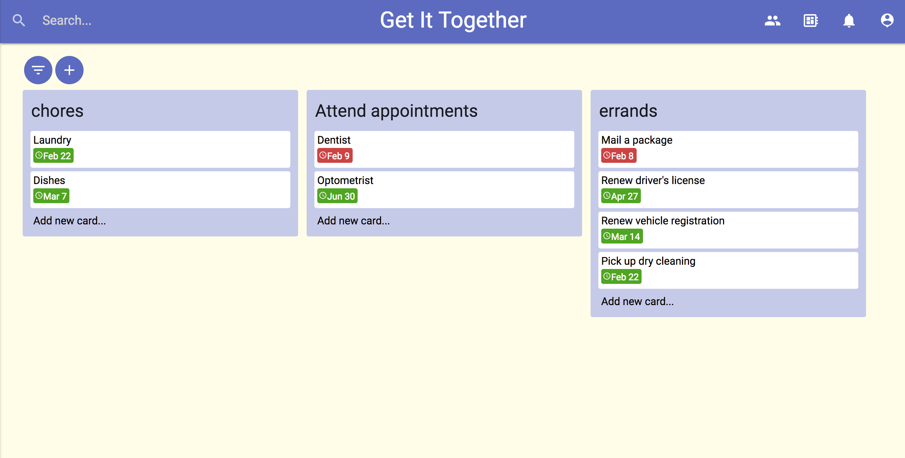

# Coordinate-Kanban-App

(React.js, Node.js, MongoDB, Express.js, Passport.js, Materialize.css) A Trello clone. Allows authenticated users to work on teams and assign tasks.

This was a captivating, enfuriating, and thought-provoking project. The problems I had to solve included:

- coding a UI similar to Trello's (using Materialize)
- translating the UI into React components
- using React to generate components as necessary
- MODALS
- coding multiple API endpoints
- figuring out Passport.js and how to keep encrypted passwords in the database
- deciding which features to keep given time constraints
- learn how to use datepickers

A Trello clone was probably a bit ambitious, and it does not currently have all of the functionality I wanted. But right now, a user can authenticate, create lists and tasks, and add task details (dates, descriptions, assigned members, comments). Not too shabby. 

## Functionality not yet implemented:

- Actions to delete/update projects lists, tasks, comments
- Commenting with user name and unique user icon
- Reorganized CSS
- Update some POST endpoints to PUT, if the request is an update

[Heroku link](https://getittogetherkanban.herokuapp.com)